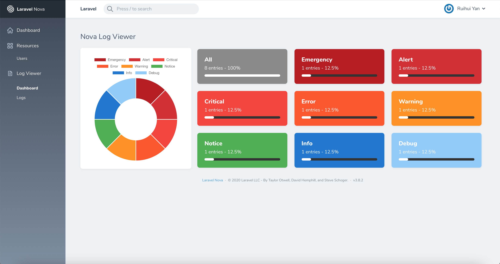
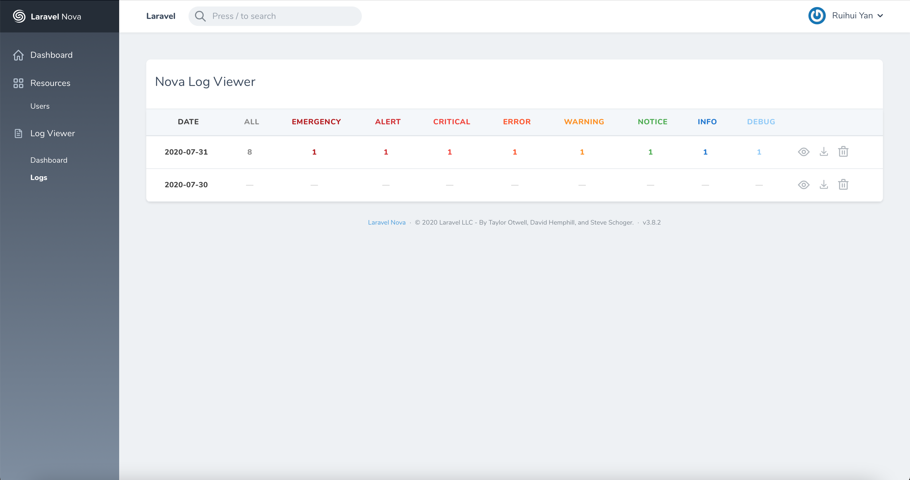
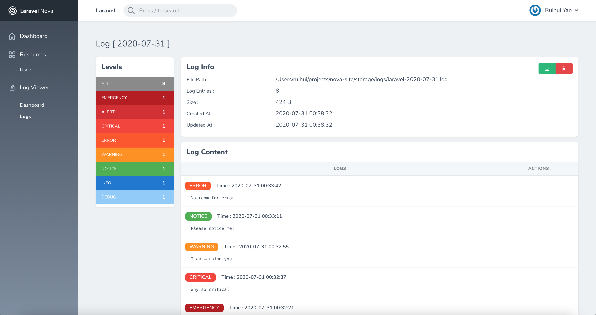

# Nova Log Viewer

[](https://packagist.org/packages/iblacker/nova-log-viewer)
[](https://packagist.org/packages/iblacker/nova-log-viewer)

## About

This is a fork of [PHPJunior/nova-logs](https://github.com/PHPJunior/nova-logs), which seems to be abandoned.
No major changes to the code, mostly updated the design to be consistent with Laravel Nova's design language. I am hoping to maintain this repo and fix any potential bug.








## Installation

You can install the package in to a Laravel app that uses [Nova](https://nova.laravel.com) via composer:

```bash
composer require iblacker/nova-log-viewer
```

**LogViewer** support only the **daily** log channel, so make sure that the `LOG_CHANNEL` is set to `daily` instead of `stack` in your `.env` file.

For Laravel 5.5 and below, set this in your `.env` file

`
APP_LOG=daily
`

Next up, you must register the tool with Nova. This is typically done in the `tools` method of the `NovaServiceProvider`.

```php
// in app/Providers/NovaServiceProvider.php

public function tools()
{
    return [
        // ...
        new \Iblacker\NovaLogViewer\Tool(),
    ];
}
```

### Changelog

Please see [CHANGELOG](CHANGELOG.md) for more information on what has changed recently.

## Configuration

You can configure the behavior of the log view within a config file. First, just publish the default one:

```
php artisan vendor:publish --tag=config
```

Now you can edit the settings in the file `config/log-viewer.php`.

## Credits

- [PHPJunior](https://github.com/PHPJunior/nova-logs)
- [ARCANEDEV](https://github.com/ARCANEDEV/LogViewer)

## License

The MIT License (MIT). Please see [License File](LICENSE.md) for more information.
